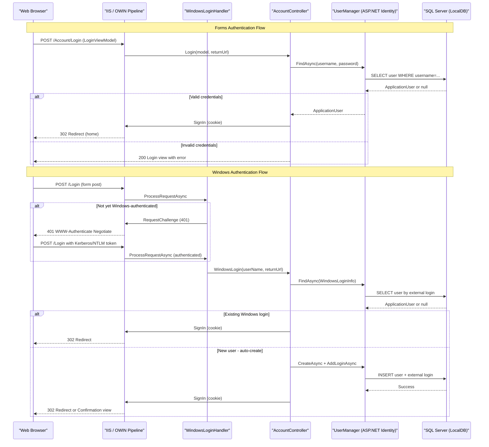

# API & Service Communication Contracts

The MixedAuth application exposes a single web service with 16 HTTP endpoints across two MVC controllers, all following a standard browser-facing request/response pattern with no REST API or inter-service communication.

## Service Catalog

| Service | Port | Category | Purpose |
|---|---|---|---|
| MixedAuth Web App | 3314 (dev IIS Express) | Business | ASP.NET MVC 5 web application providing mixed (Forms + Windows) authentication |

## API Endpoints Inventory

| Service | Method | Path | Request Type | Response Type |
|---|---|---|---|---|
| HomeController | GET | / (Home/Index) | — | Razor View (Index) |
| HomeController | GET | /Home/About | — | Razor View (About) |
| HomeController | GET | /Home/Contact | — | Razor View (Contact) |
| AccountController | GET | /Account/Login | returnUrl (query) | Razor View (Login) |
| AccountController | POST | /Account/Login | LoginViewModel (form) | Redirect or Razor View |
| AccountController | GET | /Account/Register | — | Razor View (Register) |
| AccountController | POST | /Account/Register | RegisterViewModel (form) | Redirect or Razor View |
| AccountController | GET | /Account/Manage | message (query, optional) | Razor View (Manage) |
| AccountController | POST | /Account/Manage | ManageUserViewModel (form) | Redirect or Razor View |
| AccountController | POST | /Account/Disassociate | loginProvider, providerKey (form) | Redirect |
| AccountController | POST | /Account/ExternalLogin | provider, returnUrl (form) | Challenge redirect |
| AccountController | GET | /Account/ExternalLoginCallback | returnUrl (query) | Redirect or Razor View |
| AccountController | POST | /Account/LinkLogin | provider (form) | Challenge redirect |
| AccountController | GET | /Account/LinkLoginCallback | — | Redirect |
| AccountController | POST | /Account/ExternalLoginConfirmation | ExternalLoginConfirmationViewModel (form) | Redirect or Razor View |
| AccountController | POST | /Account/LogOff | — (CSRF token) | Redirect |
| AccountController | GET | /Account/ExternalLoginFailure | — | Razor View |
| AccountController | POST | /Account/WindowsLogin | userName, returnUrl (form) | Redirect or Razor View |
| AccountController | POST | /Account/WindowsLogOff | — (CSRF token) | void (sign out) |
| AccountController | POST | /Account/LinkWindowsLogin | — (session-based userId) | Redirect |
| WindowsLoginHandler | POST | /Login (HTTP Handler) | UserName (form), returnUrl (query) | IIS challenge or delegate to AccountController |

> Note: All endpoints are browser-facing MVC endpoints returning HTML views or redirects, not REST/JSON APIs. URL routing follows the default MVC convention `{controller}/{action}/{id}`.

## Management & Observability Endpoints

| Service | Endpoint | Custom Metrics |
|---|---|---|
| MixedAuth Web App | None configured | None |

No health check endpoints, Swagger/OpenAPI documentation, diagnostics routes, or metrics endpoints are present. The application does not integrate any observability framework (e.g., Application Insights, OpenTelemetry).

## DTOs & Contracts

The application uses standard ASP.NET MVC ViewModel classes for form binding. All models are service-level (single application, no inter-service communication):

- **`LoginViewModel`** — Request model for POST /Account/Login; carries username, password, and remember-me flag.
- **`RegisterViewModel`** — Request model for POST /Account/Register; carries username and password with confirmation.
- **`ManageUserViewModel`** — Request model for POST /Account/Manage; carries old and new passwords for change-password flow.
- **`ExternalLoginConfirmationViewModel`** — Request model for POST /Account/ExternalLoginConfirmation; carries a chosen username after OAuth callback.
- **`WindowsLoginConfirmationViewModel`** — Request model used in the Windows login confirmation view; carries a username resolved from the Windows identity.

No OpenAPI/Swagger specifications, protobuf schemas, or GraphQL schemas exist. Serialization is handled implicitly by ASP.NET MVC model binding (form-encoded body). Newtonsoft.Json 5.0.6 is present as a transitive dependency of the web optimization pipeline but is not used for API serialization. See `data-architecture.md` for entity-level field details.

## Communication Patterns

**Synchronous (only)**: All communication is synchronous HTTP between a web browser and the single ASP.NET MVC application. There is no inter-service communication, message queue, event bus, or background job queue.

**Windows Authentication integration**: The custom `WindowsLoginHandler` (an `HttpTaskAsyncHandler` registered for `POST /Login` in `Web.config`) intercepts login requests before the MVC pipeline. It issues an IIS Integrated Windows Authentication challenge by returning HTTP 401, then — once the browser re-submits with Kerberos/NTLM credentials — delegates to `AccountController.WindowsLogin`. This creates an internal synchronous delegated call from handler to controller via `MvcHandler`.

**No resilience patterns**: There are no circuit breakers, retry policies (Polly or otherwise), timeouts, or bulkhead configurations. The application connects directly to the local SQL database via Entity Framework.

**No service discovery or API gateway**: There is one single deployable unit. No service registry (Eureka, Consul) or API gateway layer is present.

**Security posture**: All `HomeController` actions require authentication (`[Authorize]` on the class). Account management actions are protected individually. Anti-forgery tokens (`[ValidateAntiForgeryToken]`) are applied to all POST endpoints to prevent CSRF. Authentication is via ASP.NET Identity cookie auth (OWIN) and optionally Windows Authentication. **No HTTPS/TLS is configured by default** in `Web.config` or IIS Express settings; HTTPS would need to be enforced at the IIS or load-balancer level in production. No JWT or OAuth2 token-based API authentication is present (the application is session/cookie-based only).

## Service Technology Matrix

| Service | Web Framework | Data Access | Discovery | Gateway | Actuator/Health | Cache | Metrics |
|---|---|---|---|---|---|---|---|
| MixedAuth Web App | ASP.NET MVC 5 | Entity Framework 6 | None | None | None | None | None |

## Service Communication Sequence

