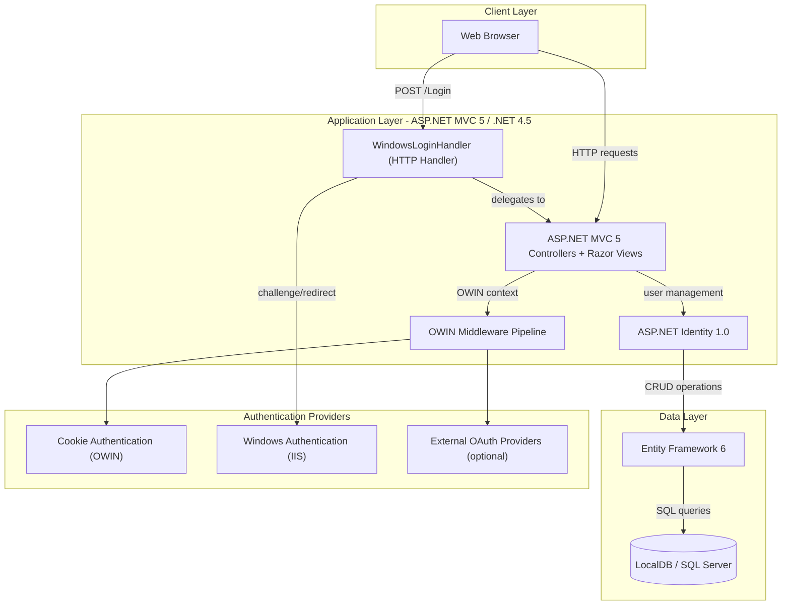
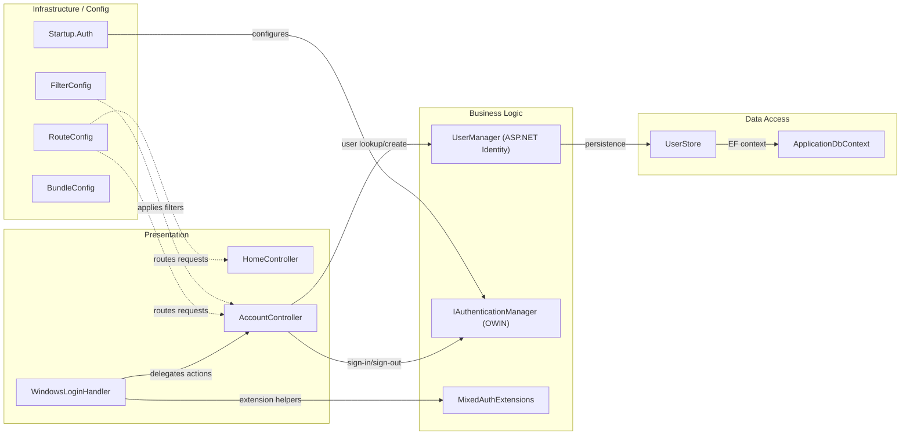

# Architecture Diagram

This document describes the architecture of the MixedAuth ASP.NET MVC 5 application, which demonstrates mixed (Forms + Windows) authentication using OWIN middleware and ASP.NET Identity.

## Application Architecture

### Technology Stack Summary

| Layer | Technology | Version | Purpose |
|---|---|---|---|
| Presentation | ASP.NET MVC 5 (Razor) | 5.0.0 | Server-side web framework with Razor views |
| UI Toolkit | Bootstrap | 3.0.0 | Responsive front-end CSS framework |
| Client Scripts | jQuery | 1.10.2 | DOM manipulation and AJAX |
| Middleware | OWIN / Katana | 2.0.0 | Authentication pipeline host |
| Authentication | ASP.NET Identity | 1.0.0 | User management and local auth |
| Authentication | Microsoft.Owin.Security.Cookies | 2.0.0 | Cookie-based session auth |
| Authentication | Windows Auth (IIS) | N/A | Integrated Windows Authentication |
| Data Access | Entity Framework | 6.0.0 | ORM for user/identity data |
| Database | SQL Server LocalDB | v11.0 | Development relational database |
| Runtime | .NET Framework | 4.5 | Application runtime |

### Data Storage & External Services

The application uses a single SQL Server LocalDB instance (configured via `DefaultConnection` connection string) to store ASP.NET Identity data (users, logins, claims). Entity Framework 6 manages the schema through `ApplicationDbContext`, which inherits from `IdentityDbContext<ApplicationUser>`. No external caches, message brokers, or third-party API integrations are active by default; external OAuth providers (Microsoft Account, Twitter, Facebook, Google) are available but commented out in `Startup.Auth.cs`.

### Key Architectural Decisions

- **Mixed Authentication**: The application uniquely combines Forms/Cookie-based authentication with Windows Authentication by routing POST requests to `/Login` through a custom `WindowsLoginHandler` HTTP handler, which challenges IIS for Windows credentials before delegating to the MVC controller.
- **OWIN Middleware**: All authentication flows are wired through the OWIN pipeline (`Startup.cs` / `Startup.Auth.cs`), decoupling auth configuration from IIS pipeline dependencies.
- **ASP.NET Identity with EF6**: Uses `UserManager<ApplicationUser>` backed by `UserStore` and `ApplicationDbContext` for user lifecycle management, supporting both local passwords and linked external logins.

## Component Relationships

### Component Inventory

| Component | Layer | Type | Responsibility |
|---|---|---|---|
| HomeController | Presentation | MVC Controller | Serves home, about, and contact pages |
| AccountController | Presentation | MVC Controller | Handles registration, login, manage, external login, and Windows login flows |
| WindowsLoginHandler | Presentation | HTTP Handler | Intercepts POST /Login requests to orchestrate Windows Authentication challenge |
| UserManager | Business Logic | ASP.NET Identity | User CRUD, password management, external login linking |
| IAuthenticationManager | Business Logic | OWIN Service | Issues and revokes authentication cookies |
| MixedAuthExtensions | Business Logic | Extension Methods | Helper methods for Windows auth session management |
| UserStore | Data Access | Identity Store | Bridges UserManager to Entity Framework |
| ApplicationDbContext | Data Access | EF DbContext | Entity Framework context for ASP.NET Identity tables |
| Startup.Auth | Infrastructure | OWIN Startup | Configures cookie and external auth middleware |
| RouteConfig | Infrastructure | MVC Configuration | Defines URL routing rules |
| FilterConfig | Infrastructure | MVC Configuration | Registers global action filters |
| BundleConfig | Infrastructure | MVC Configuration | Configures CSS and JS bundles |
