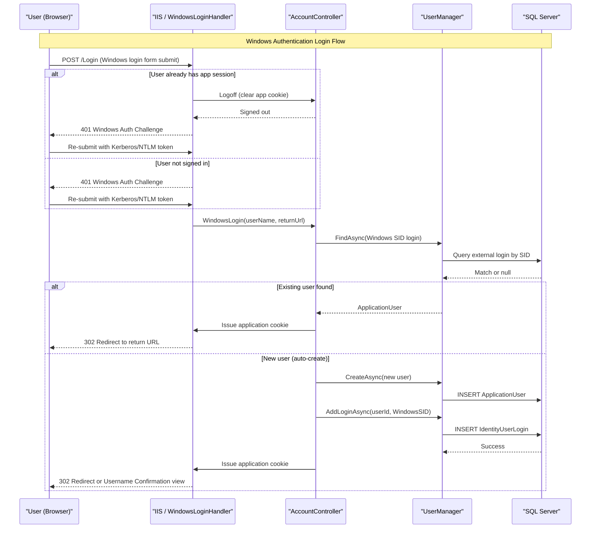

# Core Business Workflows

MixedAuth is an identity management web application that allows users to register and sign in using either a local username/password or Windows (Active Directory) credentials, with support for linking multiple authentication methods to a single account.

## Domain Entities

| Entity | Service / Bounded Context | Description | Key Relationships |
|---|---|---|---|
| ApplicationUser | Identity / User Management | A registered user account that can hold local credentials and/or linked external logins | Has zero or more UserLogins, UserClaims, UserRoles |
| IdentityUserLogin | Identity / External Login | Links an external identity (Windows SID, OAuth provider) to an ApplicationUser | Belongs to one ApplicationUser |
| IdentityUserClaim | Identity / Claims | Stores additional claims (attributes) associated with a user | Belongs to one ApplicationUser |
| IdentityRole | Identity / Authorization | A named role that can be assigned to users | Can be assigned to many ApplicationUsers via UserRoles |
| LoginViewModel | Auth Workflow / Forms Login | View model carrying username, password, and remember-me for form submission | Input to Forms login workflow |
| RegisterViewModel | Auth Workflow / Registration | View model carrying username, password, and confirmation for new account creation | Input to Registration workflow |
| ManageUserViewModel | Auth Workflow / Account Mgmt | View model for changing a password | Input to password change workflow |
| WindowsLoginConfirmationViewModel | Auth Workflow / Windows Login | View model for confirming username when auto-creating an account from Windows identity | Used in Windows login auto-create flow |

## Service-to-Domain Mapping

| Service | Domain Context | Owned Entities | External Dependencies |
|---|---|---|---|
| MixedAuth Web App | User Identity & Authentication | ApplicationUser, IdentityUserLogin, IdentityUserClaim, IdentityRole | SQL Server (user storage); IIS Windows Authentication subsystem |

This is a single-service application; there are no inter-service dependencies or cross-context communication patterns.

## Primary Workflows

### Workflow 1: User Registration (Forms Authentication)

A new visitor registers for a local account using a chosen username and password.

**Steps:**
1. User navigates to `/Account/Register`.
2. User submits `RegisterViewModel` (username + password + confirmation).
3. System validates input (username required, password minimum 6 characters, confirmation must match).
4. `UserManager.CreateAsync(user, password)` creates a new `ApplicationUser` with a PBKDF2 password hash.
5. On success, the user is automatically signed in (application cookie issued) and redirected to the home page.
6. On failure, validation errors are re-displayed on the register form.

### Workflow 2: Forms Authentication Login

A registered user signs in using their local username and password.

**Steps:**
1. User navigates to `/Account/Login` (or is redirected by the `[Authorize]` filter).
2. User submits `LoginViewModel` (username + password + remember-me).
3. System calls `UserManager.FindAsync(username, password)` — validates credentials against stored PBKDF2 hash.
4. If credentials are valid: an application cookie is issued (persistent if "Remember Me" was selected) and the user is redirected to the original URL or home page.
5. If credentials are invalid: an error is added to ModelState and the login form is re-displayed.

### Workflow 3: Windows Authentication Login

A domain user signs in using their Active Directory (Kerberos/NTLM) credentials, with auto-provisioning of a local account.

**Steps:**
1. User visits `/Account/Login` and selects the Windows login option (which submits a form POST to `/Login`).
2. The custom `WindowsLoginHandler` intercepts the POST at the IIS handler level.
3. If the user is already signed in with an application cookie, the handler signs them out first (to release IIS app-pool identity) and then issues a Windows auth challenge.
4. If the Windows challenge succeeds (IIS authenticates the user via Kerberos/NTLM): the handler delegates to `AccountController.WindowsLogin`.
5. The controller calls `UserManager.FindAsync(WindowsLoginInfo)` using the Windows SID as the external login key.
   - **Existing user**: Signs the user in with an application cookie and redirects to the return URL.
   - **New user (auto-create)**: Creates a new `ApplicationUser` (defaulting username to the domain username), links the Windows login via `AddLoginAsync`, then signs them in and redirects.
6. If the Windows identity cannot be resolved to a username, the user is shown a confirmation view to choose their username before account creation.

### Workflow 4: Link Windows Login to Existing Account

An already-authenticated user (signed in via Forms auth) links their Windows identity to their existing account.

**Steps:**
1. Authenticated user navigates to `/Account/Manage` and selects "Link Windows login".
2. The form POSTs to `/Login`, triggering `WindowsLoginHandler`.
3. The handler detects an active session (signed-in user) → saves the user ID to session → signs the user out of the application cookie → issues a Windows auth challenge.
4. After the browser re-authenticates with Windows, the handler reads the saved user ID from session and stores it in the HTTP context for the controller.
5. The handler delegates to `AccountController.LinkWindowsLogin`, which calls `UserManager.AddLoginAsync(userId, WindowsLoginInfo)`.
6. The user is signed back in with a new application cookie and redirected to the Manage page.

### Workflow 5: Account Management (Password Change / Set)

An authenticated user changes or sets a local password.

**Steps:**
1. Authenticated user navigates to `/Account/Manage`.
2. If the user has a local password (`HasPassword()` check): the user submits old and new passwords via `ManageUserViewModel` → `UserManager.ChangePasswordAsync` is called.
3. If the user has no local password (Windows-only account): the old password field is skipped → `UserManager.AddPasswordAsync` is called.
4. On success: user is redirected to Manage with a success message.
5. On failure: errors are re-displayed on the Manage form.

### Workflow 6: External OAuth Login (Disabled by Default)

Support for linking OAuth providers (Microsoft Account, Twitter, Facebook, Google) is implemented but commented out in `Startup.Auth.cs`. When enabled, the flow follows the standard OWIN external login callback pattern:
- POST /Account/ExternalLogin → OWIN challenge redirect to provider → provider redirects to /Account/ExternalLoginCallback → lookup or auto-create user → issue application cookie.

## Cross-Service Data Flows

This is a single-service application with no inter-service data flows. All data is read from and written to the single SQL Server database (via Entity Framework 6 / ASP.NET Identity). The only external system interaction is with IIS Windows Authentication, which is handled at the IIS level before the request reaches application code.

## Business Workflow Sequence

## Business Rules & Decision Logic

### Validation Rules

| Rule | Applies To | Constraint |
|---|---|---|
| Username required | Registration, Windows login confirmation | Non-empty string |
| Password required | Registration, Forms login, Manage (change) | Non-empty string |
| Password minimum length | Registration | At least 6 characters |
| Password confirmation match | Registration | `ConfirmPassword` must equal `Password` |
| Old password required (if set) | Manage — change password | Only if user already has a local password |
| Anti-forgery token | All POST endpoints | `[ValidateAntiForgeryToken]` enforced on every state-modifying action |

### Decision Logic

- **HasPassword() check**: Before the password-change form is shown, the application checks whether the user has a local password. If not, the old-password field is hidden and `AddPasswordAsync` is called instead of `ChangePasswordAsync`.
- **Windows SID lookup**: When a Windows-authenticated user logs in, the system first tries to find an existing `ApplicationUser` linked to that Windows SID. If found, the user is signed in without creating a new account. If not found, a new account is auto-created with the SID linked as an external login.
- **Session-based user ID carry**: When an already-authenticated user triggers Windows auth linking, the session is used to carry the user ID across the sign-out/re-challenge/sign-in boundary, since the application cookie is cleared as part of the Windows challenge sequence.
- **Redirect validation**: All redirect-after-login targets are validated with `Url.IsLocalUrl(returnUrl)` to prevent open redirect attacks.

### Authorization

- All `HomeController` actions require authentication (`[Authorize]` on the class).
- `AccountController` is `[Authorize]` by default, with `[AllowAnonymous]` explicitly applied to Login, Register, ExternalLoginCallback, ExternalLoginConfirmation, ExternalLoginFailure, and WindowsLogin actions.
- No role-based or claim-based authorization rules are configured beyond the basic authenticated/anonymous split.

### Error Handling

- Identity operation failures (create user, change password, add login) are surfaced via `IdentityResult.Errors`, added to `ModelState`, and re-displayed on the form.
- If Windows authentication fails (user cannot be challenged), the handler redirects to the Login page.
- If an external login callback cannot retrieve login info, the user is redirected to Login or shown the ExternalLoginFailure view.
- No compensating transactions or saga patterns are used; all operations are single-unit Entity Framework transactions.

### Cross-Cutting Concerns

- **Authentication cookie**: All write operations result in re-issuance of the OWIN application cookie to reflect updated identity claims.
- **Session state**: Used minimally — only to carry the user ID across the Windows auth challenge boundary during the link-login flow (`IRequiresSessionState` is implemented by `WindowsLoginHandler`).
- **No audit logging**: No business event logging, audit trails, or change tracking are implemented.
