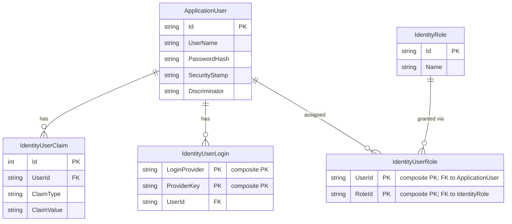

# Data Architecture & Persistence Layer

The MixedAuth application uses a single SQL Server (LocalDB in development) database managed by Entity Framework 6 with ASP.NET Identity 1.0, containing five identity-related tables with no custom domain entities beyond the built-in identity schema.

## Database Configuration

| Service/Module | DB Type | Profile | Driver | Connection | Migration Tool |
|---|---|---|---|---|---|
| MixedAuth Web App | SQL Server LocalDB v11.0 | Development (default) | System.Data.SqlClient (EF6) | `(LocalDb)\v11.0`, database `MVC5-MixedAuth`, Integrated Security | EF6 Code-First auto-create (IdentityDbContext) |
| MixedAuth Web App | SQL Server | Production | System.Data.SqlClient (EF6) | Connection string `DefaultConnection` (provider-managed) | EF6 Code-First auto-create |

Schema creation is handled automatically by `IdentityDbContext<ApplicationUser>` on first run; there are no explicit EF migrations, Flyway scripts, or seed data files. The database is created if it does not exist when the application first connects.

## Data Ownership per Service

| Service | Tables Owned | ORM Framework | Caching | Notes |
|---|---|---|---|---|
| MixedAuth Web App | AspNetUsers, AspNetUserClaims, AspNetUserLogins, AspNetUserRoles, AspNetRoles | Entity Framework 6 (via ASP.NET Identity 1.0) | None | All tables are part of ASP.NET Identity schema; ApplicationUser adds no custom columns |

## Entity Model

## Key Repository Methods

| Service | Repository | Notable Methods | Purpose |
|---|---|---|---|
| AccountController | `UserManager<ApplicationUser>` | `FindAsync(username, password)` | Validate local credentials |
| AccountController | `UserManager<ApplicationUser>` | `FindAsync(UserLoginInfo)` | Look up user by external/Windows login |
| AccountController | `UserManager<ApplicationUser>` | `FindByIdAsync(userId)` | Load user by ID (sign-back-in after Windows link) |
| AccountController | `UserManager<ApplicationUser>` | `CreateAsync(user)`, `CreateAsync(user, password)` | Create new user account |
| AccountController | `UserManager<ApplicationUser>` | `AddLoginAsync(userId, loginInfo)` | Link Windows or OAuth external login |
| AccountController | `UserManager<ApplicationUser>` | `RemoveLoginAsync(userId, loginInfo)` | Unlink an external login |
| AccountController | `UserManager<ApplicationUser>` | `AddPasswordAsync(userId, password)` | Set password for user with no local password |
| AccountController | `UserManager<ApplicationUser>` | `ChangePasswordAsync(userId, old, new)` | Change existing password |
| AccountController | `UserManager<ApplicationUser>` | `GetLogins(userId)` | List all linked external logins for the account manage page |
| AccountController | `UserManager<ApplicationUser>` | `CreateIdentityAsync(user, type)` | Create ClaimsIdentity for cookie sign-in |

All repository operations are delegated through `UserManager<ApplicationUser>` to `UserStore<ApplicationUser>`, which is backed by `ApplicationDbContext`. No custom repository interfaces, `IQueryable` extensions, stored procedures, or raw SQL are used.

## Caching Strategy

No caching layer is configured. The application performs direct synchronous/async calls to the SQL database on every request through Entity Framework 6. There are no `OutputCache` attributes, no distributed cache (Redis, MemoryCache), no EF6 second-level cache, and no query result caching. User identity data is maintained in the OWIN cookie after sign-in, which effectively acts as a client-side session but is not a server-side data cache.

## Data Ownership Boundaries

The application is a single deployable unit with a single database. There are no service boundaries, bounded contexts, or cross-service data access patterns to document. All data is owned exclusively by the `MixedAuth Web App`. Entity Framework 6 manages the connection lifecycle per HTTP request.

The schema is not explicitly versioned; it depends on Identity's automatic creation, which means schema changes (e.g., adding custom user profile columns) require manual migration authoring or enabling EF6 automatic migrations, neither of which is currently in place.

### Data Classification & Sensitivity

| Entity | Sensitive Fields | Classification | Controls in Place |
|---|---|---|---|
| ApplicationUser (AspNetUsers) | UserName, PasswordHash | PII (username), credential data | PasswordHash is stored as a salted hash (PBKDF2 via ASP.NET Identity); SecurityStamp invalidates stale sessions |
| IdentityUserClaim | ClaimType, ClaimValue | Potentially PII (depends on claims stored) | No encryption-at-rest or field-level masking configured |
| IdentityUserLogin | LoginProvider, ProviderKey | PII-adjacent (external identity reference, e.g., Windows SID) | No encryption-at-rest configured; Windows SID stored as plain string |

**No encryption-at-rest** is configured at the database or application layer for the LocalDB file. In production, SQL Server Transparent Data Encryption (TDE) would need to be enabled at the infrastructure level. No data masking, audit logging, or field-level access controls are implemented in the application code.
