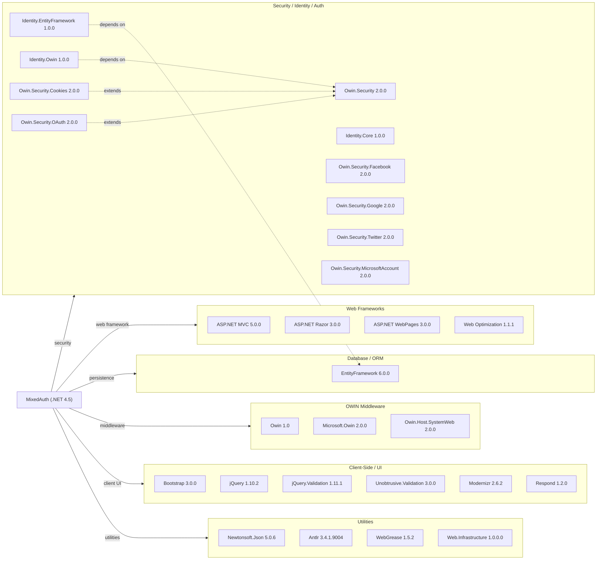

# Dependency Map

This document maps all external dependencies declared in the MixedAuth ASP.NET MVC 5 project (`packages.config`). A total of 29 declared packages are categorized below by functional area.

## Dependencies

### Dependency Summary

| Category | Count | Key Libraries | Notes |
|---|---|---|---|
| Web Frameworks | 4 | ASP.NET MVC 5.0.0, Razor 3.0.0 | Legacy MVC stack on .NET Framework 4.5 |
| Database / ORM | 1 | Entity Framework 6.0.0 | EF6 (non-Core); SQL Server LocalDB in dev |
| Security / Identity / Auth | 10 | ASP.NET Identity 1.0.0, OWIN Security 2.0.0 | Multiple OAuth provider packages present but most commented out |
| OWIN Middleware | 3 | Microsoft.Owin 2.0.0, Owin.Host.SystemWeb 2.0.0 | Katana (OWIN for .NET Framework) |
| Client-Side / UI | 6 | Bootstrap 3.0.0, jQuery 1.10.2 | All client-side packages are old but bundled statically |
| Utilities | 4 | Newtonsoft.Json 5.0.6, Antlr 3.4.1 | Support libraries for Web Optimization pipeline |

### Version & Compatibility Risks

The application targets .NET Framework 4.5, which reached end of support. All core packages are significantly outdated: ASP.NET MVC 5.0.0, Entity Framework 6.0.0, ASP.NET Identity 1.0.0, and the OWIN/Katana 2.0.0 stack have all had many subsequent major releases. ASP.NET Identity 1.0.0 is particularly old (current is 2.x, replaced by ASP.NET Core Identity on modern platforms). Newtonsoft.Json 5.0.6 is several major versions behind (current is 13.x) and has known vulnerability fixes in later versions. Bootstrap 3 and jQuery 1.10.2 are both end-of-life on the client side. Migration to .NET 8 or .NET 10 would require replacing ASP.NET MVC 5 with ASP.NET Core MVC, OWIN/Katana with ASP.NET Core middleware, EF6 with EF Core, and ASP.NET Identity 1.x with ASP.NET Core Identity.

### Notable Observations

- **Multiple unused OAuth providers**: `Owin.Security.Facebook`, `Owin.Security.Google`, `Owin.Security.Twitter`, and `Owin.Security.MicrosoftAccount` are all listed as dependencies but are commented out in `Startup.Auth.cs`, unnecessarily expanding the attack surface.
- **Very old Newtonsoft.Json**: Version 5.0.6 is from 2013; multiple security and correctness fixes have been applied since. This should be upgraded even before full migration.
- **Antlr and WebGrease as transitive build artefacts**: These packages are dependencies of the `Microsoft.AspNet.Web.Optimization` bundle, not direct application code; they do not need to be individually managed.
- **Windows Authentication via custom HTTP Handler**: The use of `WindowsLoginHandler` (an `HttpTaskAsyncHandler`) is a non-standard pattern specific to classic IIS/System.Web; it has no direct equivalent in ASP.NET Core and will require a redesign during migration.

## Test Dependencies

No test-scoped dependencies detected.

Total test-scope dependencies: 0

The project contains no unit or integration test projects. There is no dedicated test framework, test runner, or mocking library declared anywhere in the solution. Adding test coverage (e.g., xUnit or MSTest with Moq) is strongly recommended before undertaking a migration to ensure behavioral correctness can be verified.
