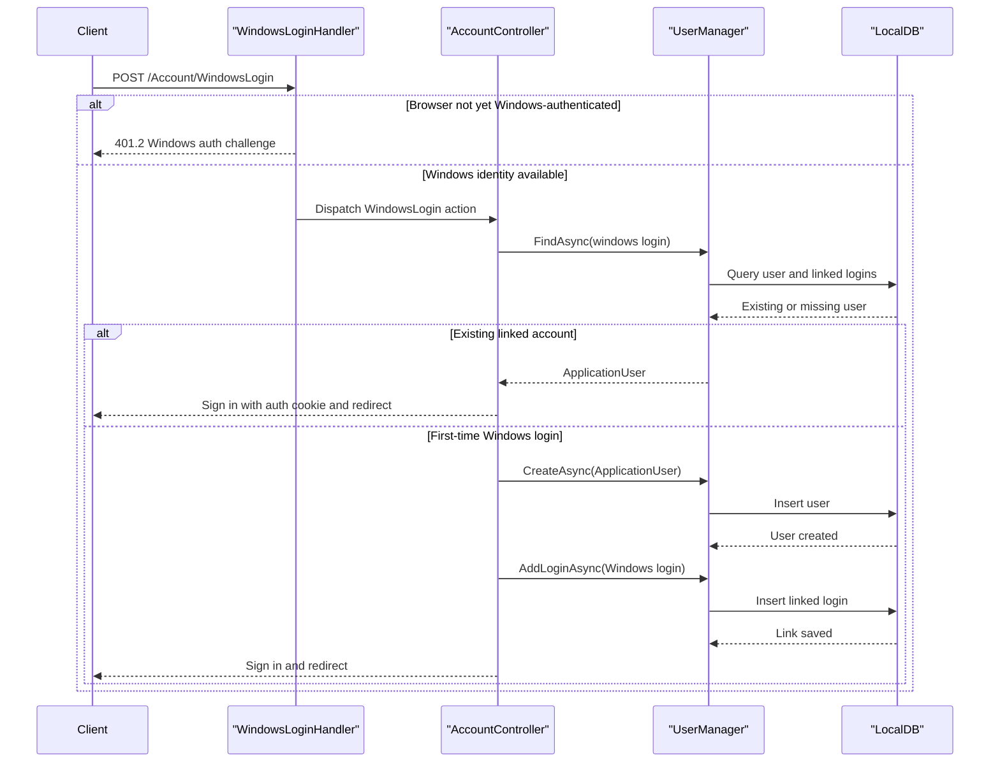

# API & Service Communication Contracts

This application exposes a small server-rendered MVC surface rather than a REST API. Its communication pattern is almost entirely synchronous request-response flows between browser clients, MVC controllers, ASP.NET Identity services, and the local identity database.

## Service Catalog

| Service | Port | Category | Purpose |
|---|---|---|---|
| MixedAuth web application | 3314 (IIS Express default) | API Layer | Hosts MVC pages and account workflows for local, Windows, and optional external sign-in |

## API Endpoints Inventory

| Service | Method | Path | Request Type | Response Type |
|---|---|---|---|---|
| MixedAuth | GET | `/Home/Index` | None | Razor view |
| MixedAuth | GET | `/Home/About` | None | Razor view |
| MixedAuth | GET | `/Home/Contact` | None | Razor view |
| MixedAuth | GET | `/Account/Login` | Query: `returnUrl` | `Login` Razor view |
| MixedAuth | POST | `/Account/Login` | Form: `LoginViewModel`, `returnUrl` | Redirect to local page or login view with validation errors |
| MixedAuth | GET | `/Account/Register` | None | `Register` Razor view |
| MixedAuth | POST | `/Account/Register` | Form: `RegisterViewModel` | Redirect to `Home/Index` or register view with validation errors |
| MixedAuth | GET | `/Account/Manage` | Query: `message` | `Manage` Razor view |
| MixedAuth | POST | `/Account/Manage` | Form: `ManageUserViewModel` | Redirect to manage page or manage view with validation errors |
| MixedAuth | POST | `/Account/Disassociate` | Form: `loginProvider`, `providerKey` | Redirect to manage page with status |
| MixedAuth | POST | `/Account/ExternalLogin` | Form: `provider`, `returnUrl` | 401 challenge / external provider redirect |
| MixedAuth | GET | `/Account/ExternalLoginCallback` | Query: `returnUrl` | Redirect or external login confirmation view |
| MixedAuth | POST | `/Account/ExternalLoginConfirmation` | Form: `ExternalLoginConfirmationViewModel`, `returnUrl` | Redirect or confirmation view with errors |
| MixedAuth | POST | `/Account/LinkLogin` | Form: `provider` | 401 challenge / provider redirect |
| MixedAuth | GET | `/Account/LinkLoginCallback` | None | Redirect to manage page |
| MixedAuth | POST | `/Account/WindowsLogin` | Form: `userName`, `returnUrl` | Redirect or Windows login confirmation view |
| MixedAuth | POST | `/Account/LinkWindowsLogin` | None | Redirect to manage page |
| MixedAuth | POST | `/Account/LogOff` | None | Redirect to `Home/Index` |
| MixedAuth | POST | `/Account/WindowsLogoff` | None | Void response used during Windows auth orchestration |
| MixedAuth | GET | `/Account/ExternalLoginFailure` | None | Error view |

## Management & Observability Endpoints

| Service | Endpoint | Custom Metrics (if any) |
|---|---|---|
| MixedAuth | None detected | None |

## DTOs & Contracts

The MVC surface uses a small set of form/view models as its API contracts: `LoginViewModel` for local sign-in, `RegisterViewModel` for local account creation, `ManageUserViewModel` for password changes, `ExternalLoginConfirmationViewModel` for external-provider account confirmation, and `WindowsLoginConfirmationViewModel` for first-time Windows account association. These are mutable C# classes rather than immutable records. Domain persistence is handled through `ApplicationUser`, while linked-login data is managed by ASP.NET Identity internals rather than custom DTOs.

No OpenAPI, Swagger, GraphQL, or protobuf schemas were detected. Serialization behavior is mostly framework-default MVC model binding plus ASP.NET Identity persistence; JSON support is present through Newtonsoft.Json but not surfaced as a documented public API contract.

## Communication Patterns

All identified communication is synchronous. Browser clients submit HTML form posts to MVC controller actions, which call ASP.NET Identity `UserManager` methods against the local SQL-backed identity store. Optional external-provider login uses standard OWIN challenge redirects, and Windows login uses a custom `WindowsLoginHandler` that triggers an IIS Windows authentication challenge before dispatching into `AccountController`.

No asynchronous messaging, service discovery, circuit breaker, retry library, or API gateway pattern was detected. Startup dependencies are minimal: routing and OWIN cookie authentication must be registered before requests are served, and Windows login depends on IIS Windows Authentication being enabled. At the API contract level, authentication and authorization are present through `[Authorize]`, `[AllowAnonymous]`, antiforgery tokens, OWIN cookies, and optional external providers; HTTPS/TLS enforcement is not explicitly configured in the source examined.

## Service Technology Matrix

| Service | Web | Data Access | Discovery | Gateway | Actuator | Cache | Metrics |
|---|---|---|---|---|---|---|---|
| MixedAuth | ASP.NET MVC 5 | EF6 + ASP.NET Identity | None | None | None | None | None |

## Service Communication Sequence

