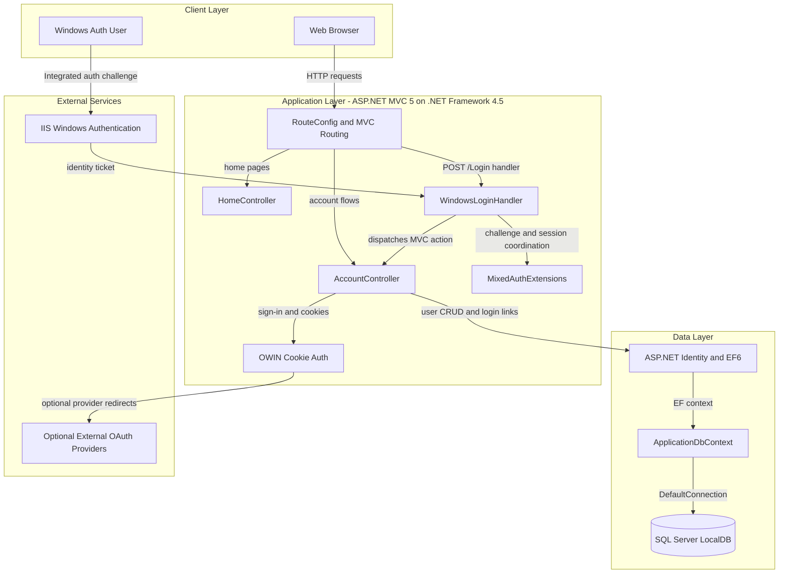
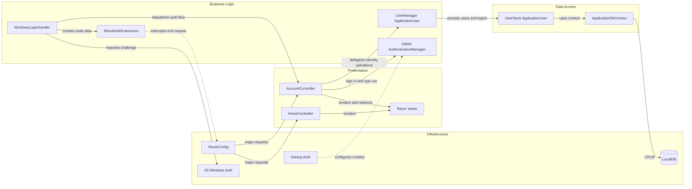

# Architecture Diagram

This document summarizes the MVC 5 web application's runtime structure and the main component interactions that implement mixed Windows, local, and optional external authentication.

## Application Architecture

### Technology Stack Summary

| Layer | Technology | Version | Purpose |
|---|---|---|---|
| Presentation | ASP.NET MVC | 5.0.0 | Server-rendered UI, routing, controllers, views |
| Authentication | OWIN + ASP.NET Identity | 2.0.0 / 1.0.0 | Cookie auth, local accounts, external login linking |
| Windows Integration | IIS Windows Authentication + custom handler | Custom | Converts Windows auth into an external-provider-like flow |
| Data Access | Entity Framework | 6.0.0 | Identity persistence through `IdentityDbContext` |
| Database | SQL Server LocalDB | LocalDb v11.0 | Default development identity store |
| Client Assets | Bootstrap, jQuery, jQuery Validation, Modernizr | 3.0.0 / 1.10.2 / 1.11.1 / 2.6.2 | UI styling and client validation |

### Data Storage & External Services

The application persists identity data to a single SQL Server LocalDB database through Entity Framework 6 and `ApplicationDbContext`. It also depends on IIS Windows Authentication for integrated sign-in and can optionally redirect to external OAuth providers such as Microsoft, Twitter, Facebook, and Google when those providers are configured.

### Key Architectural Decisions

- Uses a custom `WindowsLoginHandler` plus `MixedAuthExtensions` to make Windows authentication behave like an external identity provider inside the normal MVC account flow.
- Keeps business logic thin inside controllers and relies on ASP.NET Identity `UserManager` and `UserStore` for account creation, credential validation, login linking, and password management.
- Stores all user and linked-login data in the default ASP.NET Identity schema backed by a single LocalDB connection.

## Component Relationships

### Component Inventory

| Component | Layer | Type | Responsibility |
|---|---|---|---|
| `HomeController` | Presentation | MVC Controller | Serves authenticated home, about, and contact pages |
| `AccountController` | Presentation | MVC Controller | Handles local login, registration, password management, external login linking, and logout |
| `WindowsLoginHandler` | Business Logic | Async HTTP handler | Orchestrates Windows auth challenge, link-login handoff, and controller dispatch |
| `MixedAuthExtensions` | Business Logic | Extension/helper class | Builds route data, manages temporary session/context values, and translates fake status codes into Windows challenges |
| `UserManager<ApplicationUser>` | Business Logic | Identity service | Executes user lookup, creation, password changes, and login association logic |
| `ApplicationDbContext` | Data Access | EF `IdentityDbContext` | Persists ASP.NET Identity entities via `DefaultConnection` |
| `Startup.ConfigureAuth` | Infrastructure | OWIN startup configuration | Enables application and external sign-in cookies |
| `RouteConfig` | Infrastructure | Routing configuration | Registers default MVC route and ignores the Windows login handler route |
