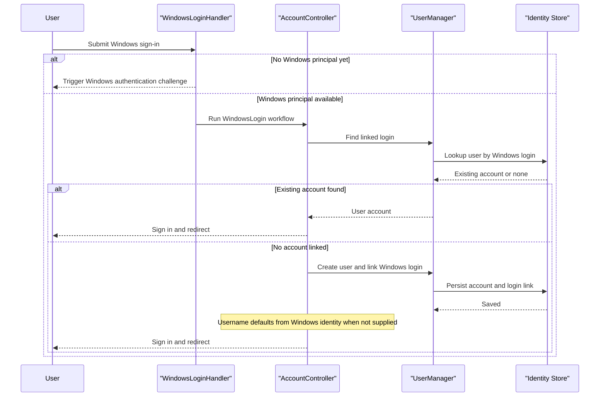

# Core Business Workflows

The application demonstrates how a user signs in to a server-rendered site using local credentials, Windows-integrated authentication, or optional external identity providers. Its primary business value is linking those authentication methods to a single ASP.NET Identity account.

## Domain Entities

| Entity | Service / Bounded Context | Description | Key Relationships |
|---|---|---|---|
| `ApplicationUser` | MixedAuth / Account Management | Site account used for local and federated sign-in | Owns linked logins, claims, and optional role assignments |
| External login | MixedAuth / Account Federation | Association between a site account and an external provider | Connects `ApplicationUser` to Google, Facebook, Twitter, Microsoft, or Windows login identities |
| Password credentials | MixedAuth / Account Security | Local password attached to an account when present | Managed alongside the user account and removable if alternate logins exist |
| Windows identity | MixedAuth / Enterprise Sign-In | Integrated Windows principal challenged by IIS | Can be linked to or used to create an `ApplicationUser` |

## Service-to-Domain Mapping

| Service | Domain Context | Owned Entities | External Dependencies |
|---|---|---|---|
| MixedAuth web application | Account Management and Authentication Federation | `ApplicationUser`, linked logins, local password state | LocalDB, IIS Windows Authentication, optional external OAuth providers |

## Primary Workflows

### Workflow 1: Local account registration and sign-in

1. Anonymous user opens `/Account/Register` or `/Account/Login`.
2. MVC model binding validates required username and password fields.
3. `AccountController` uses `UserManager.CreateAsync` or `UserManager.FindAsync` to create or authenticate the local account.
4. On success, the application issues an OWIN authentication cookie and redirects to the requested local page.
5. On failure, the view is redisplayed with model or identity errors.

### Workflow 2: First-time Windows sign-in

1. User submits the Windows sign-in form rendered in the login or manage page.
2. `WindowsLoginHandler` determines whether a Windows challenge is needed and triggers IIS integrated authentication when required.
3. After IIS provides a Windows principal, the handler dispatches the request into `AccountController.WindowsLogin`.
4. The controller looks up an existing linked login; if none exists, it creates a new `ApplicationUser`, derives a default username from the Windows identity, and links the Windows provider record.
5. The user is signed in with the application cookie and redirected back into the MVC site.

### Workflow 3: Link or remove alternate logins

1. Authenticated user opens `/Account/Manage`.
2. The page shows password-management options plus currently linked providers.
3. User can link a Windows or external provider through a challenge-based round trip, or remove an existing linked login via `Disassociate`.
4. The controller updates ASP.NET Identity storage and redirects back to the manage screen with a status message.

## Cross-Service Data Flows

There is only one deployable service, so no cross-service aggregation occurs. The only multi-step composition flow is the Windows login orchestration: IIS authenticates the Windows principal, `WindowsLoginHandler` converts that challenge-response exchange into an MVC action invocation, and the controller then merges that identity with ASP.NET Identity account data in the local database. If an external provider or Windows identity is not yet linked, the application falls back to an account confirmation/creation step before completing sign-in.

## Business Workflow Sequence

## Business Rules & Decision Logic

- Username and password inputs are required for local login and registration flows.
- New and changed passwords must be at least six characters, and confirmation fields must match.
- Password-change workflow clears the `OldPassword` validation errors when the user has no local password and is setting one for the first time.
- Windows login creation derives a username from the Windows principal if the form does not provide one explicitly.
- Linked logins can be removed only through authenticated account-management flows, and status messages are surfaced back to the user after each account change.
