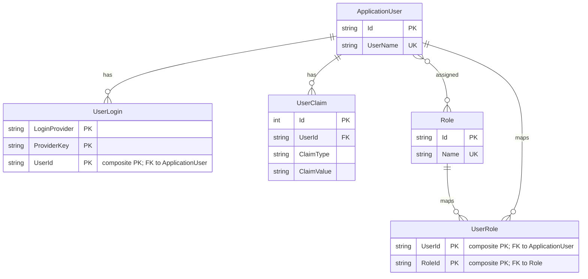

# Data Architecture & Persistence Layer

The data layer is intentionally small: the application persists authentication data through ASP.NET Identity on top of Entity Framework 6. A single SQL Server LocalDB connection backs the default identity schema, and no additional domain repositories or caches were detected.

## Database Configuration

| Service/Module | DB Type | Profile | Driver | Connection | Migration Tool |
|---|---|---|---|---|---|
| MixedAuth | SQL Server LocalDB | Default / Debug / Release | `System.Data.SqlClient` via EF6 provider | `DefaultConnection` to `(LocalDb)\v11.0` with attached MDF in `App_Data` | None detected |

## Data Ownership per Service

| Service | Tables Owned | ORM Framework | Caching | Notes |
|---|---|---|---|---|
| MixedAuth | ASP.NET Identity tables such as users, linked logins, roles, claims | Entity Framework 6 + ASP.NET Identity | None | Uses `IdentityDbContext<ApplicationUser>` with the default identity schema |

## Entity Model

## Key Repository Methods

| Service | Repository | Notable Methods | Purpose |
|---|---|---|---|
| MixedAuth | No custom repository interfaces detected | None | Persistence goes through ASP.NET Identity abstractions rather than app-specific repositories |
| MixedAuth | `UserManager<ApplicationUser>` over `UserStore<ApplicationUser>` | `FindAsync`, `CreateAsync`, `AddLoginAsync`, `RemoveLoginAsync`, `ChangePasswordAsync`, `AddPasswordAsync` | Implements account lookup, creation, linked-login maintenance, and password updates |

## Caching Strategy

No application-level caching strategy was detected. There are no cache providers, cache annotations, or cache configuration files in the analyzed source. Authentication and account data appear to be read directly from the ASP.NET Identity store on demand, with only normal authentication cookies providing session continuity.

## Data Ownership Boundaries

The application uses a single shared database for its identity data and does not split persistence across services or modules. All reads and writes flow through the same MVC application using ASP.NET Identity abstractions, so there are no cross-service data access patterns, CQRS boundaries, or aggregation-specific batch queries to document.

### Data Classification & Sensitivity

| Entity | Sensitive Fields | Classification (PII/PHI/PCI/None) | Controls in Place |
|---|---|---|---|
| `ApplicationUser` | `UserName` | PII | Access mediated by authenticated account flows; no explicit encryption-at-rest or masking configuration detected in source |
| `UserLogin` | `LoginProvider`, `ProviderKey`, `UserId` | PII | Stored through ASP.NET Identity; no explicit masking or field-level controls detected |
| `UserClaim` | `ClaimType`, `ClaimValue`, `UserId` | PII | Stored through ASP.NET Identity; no explicit additional controls detected |
