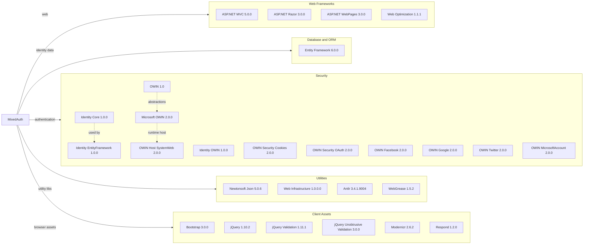

# Dependency Map

This document summarizes the declared external dependencies for the MixedAuth web application. The project declares 24 primary packages in `packages.config`, centered on the ASP.NET MVC 5, OWIN, and Entity Framework 6 stack.

## Dependencies

### Dependency Summary

| Category | Count | Key Libraries | Notes |
|---|---|---|---|
| Web Frameworks | 4 | ASP.NET MVC 5.0.0, Razor 3.0.0 | Classic ASP.NET MVC 5 stack on .NET Framework 4.5 |
| Database / ORM | 1 | Entity Framework 6.0.0 | Identity data access only; no custom domain ORM layer |
| Security | 11 | ASP.NET Identity, Microsoft.Owin, provider packages | Mixed local, Windows, and optional external authentication |
| Utilities | 4 | Newtonsoft.Json 5.0.6, WebGrease 1.5.2 | Older support libraries typical of the MVC 5 template era |
| Client Assets | 6 | Bootstrap 3.0.0, jQuery 1.10.2 | Legacy front-end libraries bundled with the application |

### Version & Compatibility Risks

The dependency set is strongly tied to .NET Framework 4.5-era ASP.NET MVC 5 packages. Entity Framework 6, ASP.NET Identity 1.x, and OWIN 2.0.0 all have upgrade paths, but they require modernization work because the project is not based on ASP.NET Core or SDK-style project conventions. Several client libraries such as jQuery 1.10.2, Bootstrap 3.0.0, and Newtonsoft.Json 5.0.6 are substantially outdated.

### Notable Observations

- Authentication concerns dominate the dependency graph, which matches the repository's mixed-auth proof-of-concept focus.
- External provider packages for Facebook, Google, Twitter, and Microsoft Account are declared even though the startup configuration leaves them commented out by default.
- The project uses `packages.config` rather than SDK-style `PackageReference`, which increases migration friction for newer .NET targets.
- There are no dedicated observability, caching, or messaging libraries declared.

## Test Dependencies

| Framework | Version | Notes |
|---|---|---|

Total test-scope dependencies: 0

No test dependencies detected. The repository does not contain a separate automated test project or test-specific NuGet packages.
