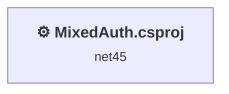
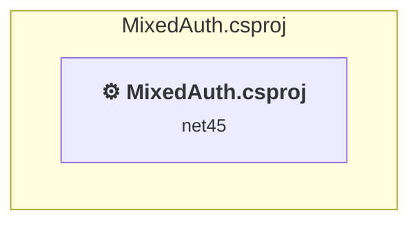

# Projects and dependencies analysis

This document provides a comprehensive overview of the projects and their dependencies in the context of upgrading to .NETCoreApp,Version=v10.0.

## Table of Contents

- [Executive Summary](#executive-Summary)
  - [Highlevel Metrics](#highlevel-metrics)
  - [Projects Compatibility](#projects-compatibility)
  - [Package Compatibility](#package-compatibility)
  - [API Compatibility](#api-compatibility)
  - [Binding Redirect Configuration](#binding-redirect-configuration)
- [Aggregate NuGet packages details](#aggregate-nuget-packages-details)
- [Top API Migration Challenges](#top-api-migration-challenges)
  - [Technologies and Features](#technologies-and-features)
  - [Most Frequent API Issues](#most-frequent-api-issues)
- [Projects Relationship Graph](#projects-relationship-graph)
- [Project Details](#project-details)

  - [MixedAuth.csproj](#mixedauthcsproj)

## Executive Summary

### Highlevel Metrics

| Metric | Count | Status |
| :--- | :---: | :--- |
| Total Projects | 1 | All require upgrade |
| Total NuGet Packages | 28 | 19 need upgrade |
| Total Code Files | 33 |  |
| Total Code Files with Incidents | 19 |  |
| Total Lines of Code | 1677 |  |
| Total Number of Issues | 543 |  |
| Estimated LOC to modify | 487+ | at least 29.0% of codebase |

### Projects Compatibility

| Project | Target Framework | Difficulty | Package Issues | API Issues | Binding Issues | Est. LOC Impact | Description |
| :--- | :---: | :---: | :---: | :---: | :---: | :---: | :--- |
| [MixedAuth.csproj](#mixedauthcsproj) | net45 | 🔴 High | 39 | 487 | 0 | 487+ | Wap, Sdk Style = False |

### Package Compatibility

| Status | Count | Percentage |
| :--- | :---: | :---: |
| ✅ Compatible | 9 | 32.1% |
| ⚠️ Incompatible | 14 | 50.0% |
| 🔄 Upgrade Recommended | 5 | 17.9% |
| ***Total NuGet Packages*** | ***28*** | ***100%*** |

### API Compatibility

| Category | Count | Impact |
| :--- | :---: | :--- |
| 🔴 Binary Incompatible | 405 | High - Require code changes |
| 🟡 Source Incompatible | 82 | Medium - Needs re-compilation and potential conflicting API error fixing |
| 🔵 Behavioral change | 0 | Low - Behavioral changes that may require testing at runtime |
| ✅ Compatible | 554 |  |
| ***Total APIs Analyzed*** | ***1041*** |  |

## Aggregate NuGet packages details

| Package | Current Version | Suggested Version | Projects | Description |
| :--- | :---: | :---: | :--- | :--- |
| Antlr | 3.4.1.9004 |  | [MixedAuth.csproj](#mixedauthcsproj) | Needs to be replaced with Replace with new package Antlr4=4.6.6 |
| bootstrap | 3.0.0 | 5.3.8 | [MixedAuth.csproj](#mixedauthcsproj) | NuGet package contains security vulnerability |
| EntityFramework | 6.0.0 | 6.5.2 | [MixedAuth.csproj](#mixedauthcsproj) | NuGet package upgrade is recommended |
| jQuery | 1.10.2 | 3.7.1 | [MixedAuth.csproj](#mixedauthcsproj) | NuGet package contains security vulnerability |
| jQuery.Validation | 1.11.1 | 1.21.0 | [MixedAuth.csproj](#mixedauthcsproj) | NuGet package contains security vulnerability |
| Microsoft.AspNet.Identity.Core | 1.0.0 |  | [MixedAuth.csproj](#mixedauthcsproj) | ⚠️NuGet package is incompatible |
| Microsoft.AspNet.Identity.EntityFramework | 1.0.0 |  | [MixedAuth.csproj](#mixedauthcsproj) | ⚠️NuGet package is incompatible |
| Microsoft.AspNet.Identity.Owin | 1.0.0 |  | [MixedAuth.csproj](#mixedauthcsproj) | ⚠️NuGet package is incompatible |
| Microsoft.AspNet.Mvc | 5.0.0 |  | [MixedAuth.csproj](#mixedauthcsproj) | NuGet package functionality is included with framework reference |
| Microsoft.AspNet.Razor | 3.0.0 |  | [MixedAuth.csproj](#mixedauthcsproj) | NuGet package functionality is included with framework reference |
| Microsoft.AspNet.Web.Optimization | 1.1.1 |  | [MixedAuth.csproj](#mixedauthcsproj) | ⚠️NuGet package is incompatible |
| Microsoft.AspNet.WebPages | 3.0.0 |  | [MixedAuth.csproj](#mixedauthcsproj) | NuGet package functionality is included with framework reference |
| Microsoft.jQuery.Unobtrusive.Validation | 3.0.0 |  | [MixedAuth.csproj](#mixedauthcsproj) | ✅Compatible |
| Microsoft.Owin | 2.0.0 |  | [MixedAuth.csproj](#mixedauthcsproj) | ⚠️NuGet package is incompatible |
| Microsoft.Owin.Host.SystemWeb | 2.0.0 |  | [MixedAuth.csproj](#mixedauthcsproj) | ⚠️NuGet package is incompatible |
| Microsoft.Owin.Security | 2.0.0 |  | [MixedAuth.csproj](#mixedauthcsproj) | ⚠️NuGet package is incompatible |
| Microsoft.Owin.Security.Cookies | 2.0.0 |  | [MixedAuth.csproj](#mixedauthcsproj) | ⚠️Replace with Microsoft.AspNetCore.Authentication.Cookies: Use AddAuthentication().AddCookie() in Startup; adjust cookie options |
| Microsoft.Owin.Security.Facebook | 2.0.0 |  | [MixedAuth.csproj](#mixedauthcsproj) | ⚠️NuGet package is incompatible |
| Microsoft.Owin.Security.Google | 2.0.0 |  | [MixedAuth.csproj](#mixedauthcsproj) | ⚠️NuGet package is incompatible |
| Microsoft.Owin.Security.MicrosoftAccount | 2.0.0 |  | [MixedAuth.csproj](#mixedauthcsproj) | ⚠️NuGet package is incompatible |
| Microsoft.Owin.Security.OAuth | 2.0.0 |  | [MixedAuth.csproj](#mixedauthcsproj) | ⚠️Replace with Microsoft.AspNetCore.Authentication.JwtBearer: Use JWT Bearer for token validation; adopt IdentityServer or Azure AD for issuing tokens |
| Microsoft.Owin.Security.Twitter | 2.0.0 |  | [MixedAuth.csproj](#mixedauthcsproj) | ⚠️NuGet package is incompatible |
| Microsoft.Web.Infrastructure | 1.0.0.0 |  | [MixedAuth.csproj](#mixedauthcsproj) | NuGet package functionality is included with framework reference |
| Modernizr | 2.6.2 |  | [MixedAuth.csproj](#mixedauthcsproj) | ✅Compatible |
| Newtonsoft.Json | 5.0.6 | 13.0.4 | [MixedAuth.csproj](#mixedauthcsproj) | NuGet package upgrade is recommended |
| Owin | 1.0 |  | [MixedAuth.csproj](#mixedauthcsproj) | ⚠️NuGet package is incompatible |
| Respond | 1.2.0 |  | [MixedAuth.csproj](#mixedauthcsproj) | ✅Compatible |
| WebGrease | 1.5.2 |  | [MixedAuth.csproj](#mixedauthcsproj) | ✅Compatible |

## Top API Migration Challenges

### Technologies and Features

| Technology | Issues | Percentage | Migration Path |
| :--- | :---: | :---: | :--- |
| ASP.NET Framework (System.Web) | 420 | 86.2% | Legacy ASP.NET Framework APIs for web applications (System.Web.*) that don't exist in ASP.NET Core due to architectural differences. ASP.NET Core represents a complete redesign of the web framework. Migrate to ASP.NET Core equivalents or consider System.Web.Adapters package for compatibility. |

### Most Frequent API Issues

| API | Count | Percentage | Category |
| :--- | :---: | :---: | :--- |
| T:System.Web.HttpContext | 19 | 3.9% | Source Incompatible |
| T:System.Web.Mvc.ActionResult | 17 | 3.5% | Binary Incompatible |
| T:System.Web.Mvc.RedirectToRouteResult | 16 | 3.3% | Binary Incompatible |
| T:System.Web.Mvc.ViewResult | 14 | 2.9% | Binary Incompatible |
| P:System.Web.Mvc.ControllerBase.ViewBag | 14 | 2.9% | Binary Incompatible |
| M:System.Web.Mvc.HttpPostAttribute.#ctor | 11 | 2.3% | Binary Incompatible |
| T:System.Web.Mvc.HttpPostAttribute | 11 | 2.3% | Binary Incompatible |
| M:System.Web.Mvc.AllowAnonymousAttribute.#ctor | 10 | 2.1% | Binary Incompatible |
| T:System.Web.Mvc.AllowAnonymousAttribute | 10 | 2.1% | Binary Incompatible |
| P:Microsoft.AspNet.Identity.IdentityResult.Succeeded | 10 | 2.1% | Binary Incompatible |
| M:System.Web.Mvc.ValidateAntiForgeryTokenAttribute.#ctor | 10 | 2.1% | Binary Incompatible |
| T:System.Web.Mvc.ValidateAntiForgeryTokenAttribute | 10 | 2.1% | Binary Incompatible |
| T:Microsoft.AspNet.Identity.UserLoginInfo | 9 | 1.8% | Binary Incompatible |
| P:System.Web.Mvc.Controller.User | 9 | 1.8% | Binary Incompatible |
| T:Microsoft.AspNet.Identity.IdentityExtensions | 9 | 1.8% | Binary Incompatible |
| M:Microsoft.AspNet.Identity.IdentityExtensions.GetUserId(System.Security.Principal.IIdentity) | 9 | 1.8% | Binary Incompatible |
| T:System.Web.Mvc.ModelStateDictionary | 8 | 1.6% | Binary Incompatible |
| P:System.Web.Mvc.Controller.ModelState | 8 | 1.6% | Binary Incompatible |
| T:System.Web.Routing.RouteValueDictionary | 8 | 1.6% | Binary Incompatible |
| P:System.Web.Routing.RouteData.Values | 8 | 1.6% | Binary Incompatible |
| M:System.Web.Routing.RouteValueDictionary.Add(System.String,System.Object) | 8 | 1.6% | Binary Incompatible |
| M:System.Web.Mvc.Controller.View | 7 | 1.4% | Binary Incompatible |
| M:System.Web.Mvc.Controller.RedirectToAction(System.String) | 7 | 1.4% | Binary Incompatible |
| M:System.Web.Mvc.Controller.RedirectToAction(System.String,System.Object) | 6 | 1.2% | Binary Incompatible |
| T:System.Web.Routing.RouteData | 6 | 1.2% | Binary Incompatible |
| T:System.Web.Mvc.UrlHelper | 5 | 1.0% | Binary Incompatible |
| P:System.Web.Mvc.Controller.Url | 5 | 1.0% | Binary Incompatible |
| P:System.Web.Mvc.ModelStateDictionary.IsValid | 5 | 1.0% | Binary Incompatible |
| T:System.Web.Optimization.Bundle | 5 | 1.0% | Binary Incompatible |
| M:System.Web.Optimization.BundleCollection.Add(System.Web.Optimization.Bundle) | 5 | 1.0% | Binary Incompatible |
| T:System.Web.HttpRequestBase | 4 | 0.8% | Source Incompatible |
| P:System.Web.Mvc.Controller.Request | 4 | 0.8% | Binary Incompatible |
| P:System.Web.HttpRequestBase.LogonUserIdentity | 4 | 0.8% | Source Incompatible |
| T:System.Web.HttpContextBase | 4 | 0.8% | Source Incompatible |
| P:System.Web.HttpContextBase.Items | 4 | 0.8% | Source Incompatible |
| T:Microsoft.AspNet.Identity.DefaultAuthenticationTypes | 4 | 0.8% | Binary Incompatible |
| M:System.Web.Mvc.Controller.View(System.Object) | 4 | 0.8% | Binary Incompatible |
| P:Microsoft.AspNet.Identity.Owin.ExternalLoginInfo.Login | 4 | 0.8% | Binary Incompatible |
| T:System.Web.Mvc.Html.MvcForm | 4 | 0.8% | Binary Incompatible |
| T:System.Web.Mvc.FormMethod | 4 | 0.8% | Binary Incompatible |
| T:System.Web.SessionState.HttpSessionState | 4 | 0.8% | Source Incompatible |
| P:System.Web.HttpContext.Session | 4 | 0.8% | Source Incompatible |
| T:System.Web.HttpResponse | 4 | 0.8% | Source Incompatible |
| P:System.Web.HttpContext.Response | 4 | 0.8% | Source Incompatible |
| T:System.Web.Optimization.ScriptBundle | 4 | 0.8% | Binary Incompatible |
| M:System.Web.Optimization.ScriptBundle.#ctor(System.String) | 4 | 0.8% | Binary Incompatible |
| M:System.Web.Mvc.AuthorizeAttribute.#ctor | 3 | 0.6% | Binary Incompatible |
| T:System.Web.Mvc.AuthorizeAttribute | 3 | 0.6% | Binary Incompatible |
| M:System.Web.Mvc.Controller.#ctor | 3 | 0.6% | Binary Incompatible |
| P:System.Web.Mvc.Controller.HttpContext | 3 | 0.6% | Binary Incompatible |

## Projects Relationship Graph

Legend:
📦 SDK-style project
⚙️ Classic project

## Project Details

### MixedAuth.csproj

#### Project Info

- **Current Target Framework:** net45
- **Proposed Target Framework:** net10.0
- **SDK-style**: False
- **Project Kind:** Wap
- **Dependencies**: 0
- **Dependants**: 0
- **Number of Files**: 61
- **Number of Files with Incidents**: 19
- **Lines of Code**: 1677
- **Estimated LOC to modify**: 487+ (at least 29.0% of the project)

#### Dependency Graph

Legend:
📦 SDK-style project
⚙️ Classic project

### API Compatibility

| Category | Count | Impact |
| :--- | :---: | :--- |
| 🔴 Binary Incompatible | 405 | High - Require code changes |
| 🟡 Source Incompatible | 82 | Medium - Needs re-compilation and potential conflicting API error fixing |
| 🔵 Behavioral change | 0 | Low - Behavioral changes that may require testing at runtime |
| ✅ Compatible | 554 |  |
| ***Total APIs Analyzed*** | ***1041*** |  |

#### Project Technologies and Features

| Technology | Issues | Percentage | Migration Path |
| :--- | :---: | :---: | :--- |
| ASP.NET Framework (System.Web) | 420 | 86.2% | Legacy ASP.NET Framework APIs for web applications (System.Web.*) that don't exist in ASP.NET Core due to architectural differences. ASP.NET Core represents a complete redesign of the web framework. Migrate to ASP.NET Core equivalents or consider System.Web.Adapters package for compatibility. |

